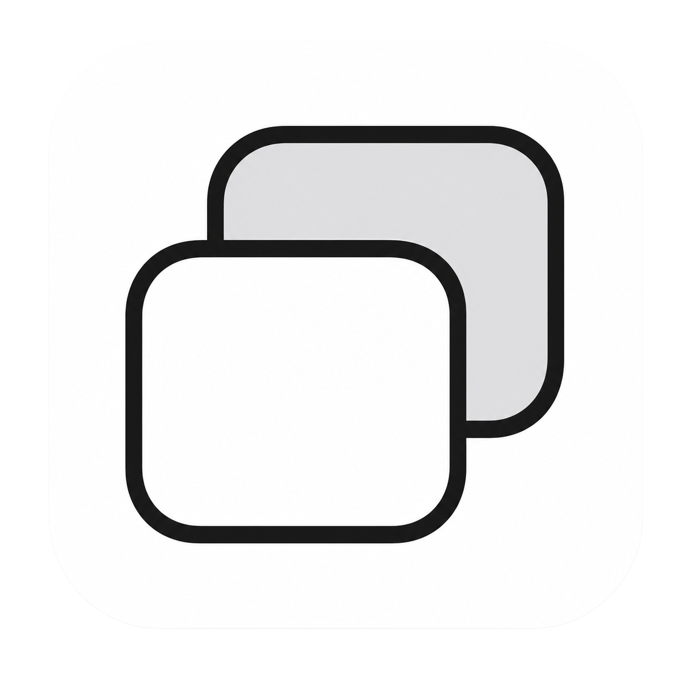
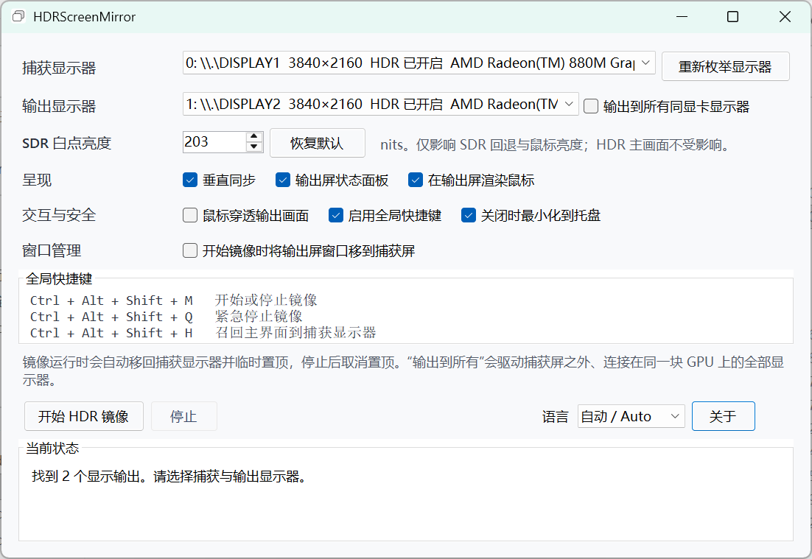
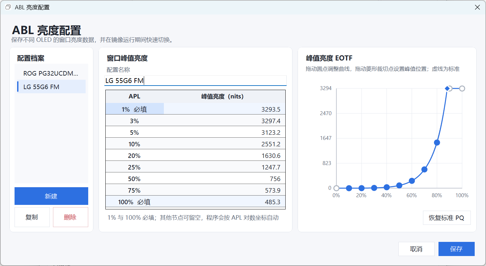
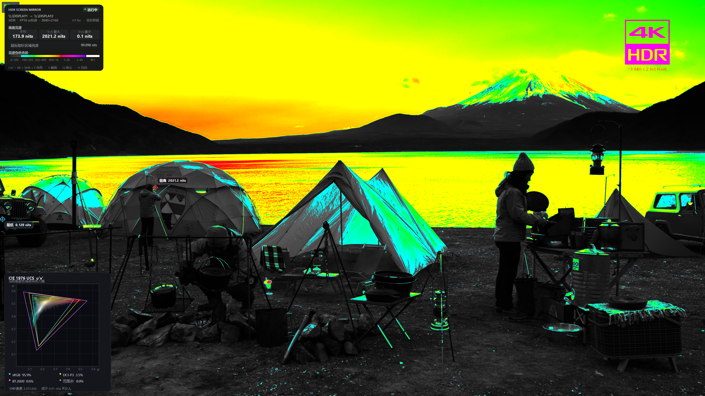

  

<h1 align="center">HDRScreenMirror</h1>

An HDR screen mirroring tool for Windows

<a href="README.md">简体中文</a> ｜ <strong>English</strong>

## Why HDRScreenMirror exists

Windows cannot normally enable display duplication after HDR is turned on and can only use the displays in extended mode. This is inconvenient, for example, when you want to compare the HDR image quality of two monitors connected to one computer.

HDRScreenMirror captures the desktop from one display in real time and copies it to a target display through Direct3D 11 using an FP16 scRGB HDR output path.

In short, it provides an approximation of display duplication while Windows HDR remains enabled.

It now includes a complete suite of HDR analysis tools.

## Interface

### Main window

### ABL luminance configuration

### HDR analysis tools

## Features

1. Real time Windows HDR desktop capture and mirroring.
2. FP16 scRGB HDR output designed to preserve HDR luminance and color information.
3. A single output display or every other display connected to the same GPU.
4. HDR single display analysis without an output display.
5. Automatic aspect ratio preservation with black bars when required.
6. Optional cursor rendering on output displays.
7. An optional live status panel in the top left corner of a mirror output or the analyzed capture display.
8. Global hotkeys.
9. HDR luminance analysis tools.
10. HDR gamut analysis tools.
11. Three frame rate policies: follow the output display, fixed limit, and unlimited.
12. Automatic session recovery and layout adaptation after Windows resolution or display mode changes.
13. OLED ABL luminance estimation from user supplied window luminance measurements, including estimated average, maximum, and minimum frame luminance after ABL.

## Requirements

1. A 64 bit edition of Windows 10 or Windows 11.
2. [.NET 8 Desktop Runtime](https://dotnet.microsoft.com/download/dotnet/8.0).
3. A GPU and driver that support Direct3D 11 and Desktop Duplication.
4. For HDR multi display mirroring, the capture and output displays must be connected to the same GPU.
5. For HDR multi display mirroring, HDR must be enabled in Windows for the output display.

## Installation

1. Download and extract the `win-x64` archive from Releases.
2. Make sure .NET 8 Desktop Runtime is installed.
3. Run `HDRScreenMirror.exe`.

No installer is required. Delete the extracted directory to remove the application.

Application settings and ABL profiles are stored in `%LocalAppData%\HDRScreenMirror\settings.json`, so moving or replacing the application directory does not remove them.

## How to use it

### HDR multi display mirroring

1. Open Windows Settings and set the displays to “Extend these displays”.
2. Enable HDR in Windows for the target display.
3. Start `HDRScreenMirror.exe`.
4. Select the source screen under “Capture display”.
5. Select the target screen under “Output display”.
6. Click “Start HDR mirror”.
7. Click “Stop” or use a global hotkey when you want to end the mirror session.

### HDR single display analysis

Single display analysis does not create a mirror output window. A system with only one connected display can still show frame luminance, cursor area luminance, ABL estimation, luminance markers, and the real time gamut analysis panel.

1. Select “HDR single-display analysis” under “Mode”.
2. Select the display to analyze under “Capture display”.
3. Enable at least one of the status panel, highest and lowest luminance markers, or the real time gamut analysis panel.
4. Click “Start HDR analysis”.
5. The control panel hides to the tray. Analysis overlays appear on the capture display and are excluded from Desktop Duplication.
6. Press `Ctrl + F8` to stop analysis or `Ctrl + F12` to recall the control panel.

Single display analysis can cover applications that use normal windowed fullscreen. It cannot cover exclusive fullscreen applications or applications that use an independent presentation path.

### Mirroring to three or more displays

Enable “All displays on this GPU” to ignore the single output selection and present the captured image to every other display connected to the capture GPU.

For example, if three displays are connected to one GPU, HDRScreenMirror can capture the first display and present it to the second and third displays at the same time.

## Main options

| Option | Default | Purpose |
| --- | --- | --- |
| Mode | HDR multi-display mirroring | Manually switches between HDR multi display mirroring and HDR single display analysis; analysis does not require an output display |
| SDR white level | 203 nits | Controls SDR fallback and cursor brightness in the HDR output without changing the FP16 HDR image |
| Frame rate | Follow output display | Offers follow output display, fixed limit, and unlimited modes; the fixed limit supports 24 to 500 fps |
| Status panel | Enabled | Shows resolution, format, frame rate, cursor state, and frame luminance data in the top left corner of a mirror output or the analyzed capture display |
| Render cursor on output | Enabled | Composites the capture display cursor into the mirror image |
| Show cursor area luminance | Enabled | Shows the average luminance of the area under the cursor to three decimal places; reports when the cursor is outside the capture area |
| Output luminance false color | Disabled | Switches every output display to the same luminance false color view and shows its scale in the status panel |
| Mark highest and lowest luminance | Disabled | Marks the highest and lowest average luminance locations on the output image and shows their values |
| Show ABL estimated luminance | Disabled | Estimates average, maximum, and minimum frame luminance after OLED ABL using the selected profile, and shows equivalent APL, overall scale, and luminance reduction |
| Real-time gamut analysis panel | Disabled | Shows the current frame CIE 1976 `u′v′` heatmap, three reference gamut triangles, and mutually exclusive gamut percentages in the bottom left corner |
| Click through mirror | Disabled | Multi display mirroring only; lets mouse clicks reach the desktop behind the mirror window |
| Enable global hotkeys | Enabled | Registers shortcuts for start or stop, false color, screenshots, the status panel, and control panel recall |
| Minimize to tray on close | Disabled | Hides the control panel while keeping an active mirror session running |
| Move output windows to capture display on start | Disabled | Prevents windows from becoming inaccessible behind the mirror; minimized, system, and elevated windows may not move |
| Screenshot save mode | Save automatically | Can save directly or ask for a location on every capture |
| Screenshot folder | `Screenshots` beside the application | Used by automatic saving and can be changed with “Choose folder” |

### Frame rate policies

| Mode | Purpose |
| --- | --- |
| Follow output display | The default. Paces processing with the output display and avoids unnecessary high frame rate processing when the capture display has a higher refresh rate |
| Fixed limit | Limits processing to a configured rate from 24 to 500 fps |
| Unlimited | Does not actively limit processing and favors the highest available capture rate at the cost of additional GPU usage |

Stop the current session before changing the frame rate policy. If the Windows resolution or display mode changes, the application rescans the displays, rebuilds the session, and automatically resumes the previous operation mode.

### Real time gamut analysis panel

Shows the percentage of current frame elements that fall within each gamut range.

### OLED ABL luminance estimation

Open “Manage profiles” to save window luminance measurements for one or more OLED displays. Every profile requires peak luminance at 1% and 100% APL. Optional measurements are available at 3%, 5%, 10%, 20%, 25%, 50%, and 75%. Missing points are interpolated piecewise on a logarithmic APL axis.

When “Show ABL estimated luminance” is enabled, source signal luminance is first clipped to the 1% APL peak. The base frame average determines the equivalent APL, then the entire frame is scaled by the ratio between the interpolated peak at that APL and the 1% peak. The status panel shows:

1. Estimated average, maximum, and minimum frame luminance after ABL.
2. The equivalent APL of the current frame.
3. The overall scale and luminance reduction produced by the selected profile.

Profiles can be created, duplicated, renamed, deleted, and saved. The active profile and ABL estimation can be changed while a session is running without stopping it. All output displays use the same active profile.

### Luminance false color scale

| Luminance range | Continuous color transition |
| --- | --- |
| 0 to 100 nits | Black continuously rising to gray |
| 100 to 203 nits | Cyan continuously transitioning to green |
| 203 to 400 nits | Green continuously transitioning to yellow |
| 400 to 1000 nits | Yellow continuously transitioning to red |
| 1000 to 2000 nits | Red continuously transitioning to magenta |
| 2000 to 4000 nits | Magenta continuously transitioning to blue violet |
| 4000 nits and above | White |

## Global hotkeys

| Hotkey | Action |
| --- | --- |
| `Ctrl + F8` | Start or stop the selected mirror or analysis mode |
| `Ctrl + F9` | Toggle luminance false color in multi display mirroring |
| `Ctrl + F10` | Capture the mirror image on every output display in multi display mirroring |
| `Ctrl + F11` | Show or hide the status panel |
| `Ctrl + F12` | Recall the control panel to the capture display |

## Output screenshots

After multi display mirroring starts, press `Ctrl + F10` to capture the image actually shown on every output display. A brief confirmation appears on the output display after the files are saved. The PNG includes the false color view, visible status panel, real time gamut analysis panel, and luminance markers. Multiple output displays are saved as separate images. Output image capture is unavailable in single display analysis.

“Save automatically” writes images directly to the configured folder. The default is a `Screenshots` folder beside `HDRScreenMirror.exe`. “Choose a location each time” opens a save dialog after the hotkey is pressed.

The output windows are normally excluded from Windows screen capture protection, so a system screenshot tool may not see them. The built in capture briefly removes that exclusion while taking the image and restores it immediately afterward. PNG files are visual records of the false color analysis and do not contain the original FP16 HDR data.

## System tray

When “Minimize to tray on close” is enabled, closing the main window only hides the control panel. An active mirror session continues running.

Double click the tray icon to show the control panel again. The tray menu can also show the control panel, start or stop mirroring, or exit the application completely.

## Troubleshooting

### Mirroring does not start

Confirm that the capture and output displays are different and connected to the same GPU. Also verify that HDR is enabled in Windows for the target display.

### Brightness or color looks incorrect

Check the Windows HDR state of the output display first. If the capture driver only supplies SDR BGRA8 frames, HDRScreenMirror must use the SDR fallback path and cannot restore HDR highlights that Windows has already tone mapped away.

### A video is not captured

Some DRM protected content and some Windows MPO hardware overlays may not enter Desktop Duplication reliably. This is a limitation of the Windows capture path.

### The control panel is missing

Press `Ctrl + F12`. If tray mode is enabled, you can also double click the tray icon.

### A fullscreen application covers single display analysis overlays

Analysis overlays automatically recover their window level over applications that use normal windowed fullscreen, including MPC BE. Normal Windows topmost windows cannot cover exclusive fullscreen applications or applications that use an independent presentation path, including the fullscreen mode of HDR + WCG Image Viewer. Use windowed, maximized, or borderless fullscreen mode instead.

## Known limitations

1. Cross GPU mirroring is not currently supported.
2. HDR multi display mirroring cannot use the same display for capture and output; HDR single display analysis does not create an output window.
3. Some MPO surfaces, protected videos, and exclusive fullscreen content may not be available to Desktop Duplication.
4. HDR single display analysis overlays cannot cover exclusive fullscreen applications or applications that use an independent presentation path.

## Changelog

### 1.7.0

1. Added manually selectable HDR multi display mirroring and HDR single display analysis modes.
2. Added single display analysis without an output display, with the status panel, luminance markers, and real time gamut analysis panel shown on the capture display.

### 1.6.1

1. Restored application settings and ABL profiles to `%LocalAppData%\HDRScreenMirror\settings.json`.

### 1.6.0

1. Added ABL simulation using user supplied OLED HDR window luminance measurements and an editable EOTF curve to estimate physical display luminance.

### 1.5.0

1. Added follow output display, fixed limit, and unlimited frame rate policies, with follow output display as the default.
2. Added a persistent fixed frame rate limit from 24 to 500 fps.
3. Fixed image cropping when capture and output displays use different Windows resolutions or DPI scaling values.
4. Added display mode change detection during mirroring, with automatic output adaptation and mirror recovery after a resolution change.
5. Improved the default control panel size and option layout to prevent clipped descriptions and controls.

### 1.4.1

1. Removed the redundant emergency stop shortcut; `Ctrl + F8` is now the single shortcut for stopping mirroring.
2. Changed `Ctrl + F11` to show or hide the output status panel, both before and during mirroring.

### 1.4.0

1. Added average frame luminance, maximum and minimum luminance, and cursor area luminance analysis.
2. Added luminance false color output, maximum and minimum luminance markers, and a CIE 1976 `u′v′` gamut heatmap.
3. Added output image capture with automatic or manual saving and a success notification.
4. Added live analysis controls during mirroring and increased the full frame analysis refresh rate to approximately 250 ms.
5. Changed global hotkeys to `Ctrl + F8` through `Ctrl + F12`, with repeat suppression and per shortcut conflict reporting.

### 1.3.2

1. Fixed mirror failures caused by Windows secure desktop and UAC administrator prompts.
2. Added single instance operation; launching the application again recalls the existing control panel.

### 1.3.1

1. Added an option to move output display windows to the capture display when mirroring starts.
2. Improved the main window layout and status reporting.

### 1.3.0

Initial public release.
